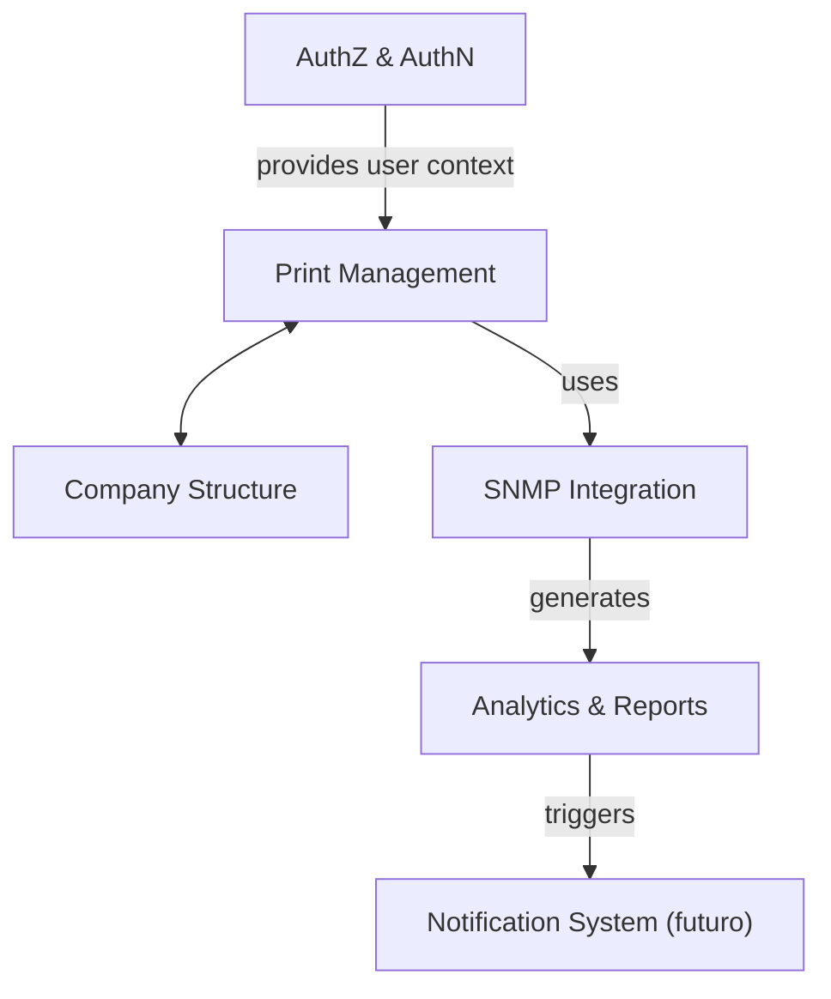

# Modelagem de domínio

## Identificação de domínio e subdomínios

1. Domínio Principal

Gestão de Impressões Corporativas

Objetivo: Gerenciar o uso, custo e estado das impressoras da empresa, oferecendo visibilidade gerencial e operando com múltiplas fontes de dados (manual e automática).

2. Subdomínios Identificados

| Subdomínio               | Tipo               | Descrição                                             |
| ------------------------ | ------------------ | ----------------------------------------------------- |
| Core de Impressão        | Domínio Principal  | Lida com impressoras, coletas, registros e contadores |
| Organizacional           | Domínio de Apoio   | Estrutura organizacional: unidades, departamentos     |
| AuthZ/AuthN              | Domínio Genérico   | Controle de acesso, gestão de usuários                |
| Infraestrutura de Coleta | Domínio Técnico    | Integração com SNMP, agendamento de jobs              |
| Relatórios e Métricas    | Domínio Principal  | Cálculo de volume, custo, gráficos e dashboards       |
| Notificações/Alertas     | Domínio Secundário | Envio de alertas com base em regras definidas         |

3. Bounded Contexts

1. Print Management

Responsável por:

- Cadastro de impressoras
- Histórico de impressões
- Interface de coleta manual
- Registro de contadores

> Entidades principais: Printer, PrintRecord

2. SNMP Integration

Responsável por:

- Coletas automáticas via SNMP
- Gestão de agendamentos (ex: BullMQ)
- Tradução de OIDs para contadores

> Entidades: SnmpJob, SnmpTarget, OidMap

3. Company

Responsável por:

- Cadastro de unidades (filiais)
- Cadastro de departamentos
- Associação com impressoras e relatórios

> Entidades: Company, Unit, Department

4. Identity

Responsável por:

- Login e autenticação com JWT
- Perfis de acesso (admin, gestor, operador)
- Controle por unidade ou departamento

> Entidades: User, Role, Permission

5. Analytics & Reports

Responsável por:

- Cálculo de volume e custo de impressão
- Dashboards e gráficos
- Filtros por período, unidade e departamento

> Entidades: ReportQuery, MetricSnapshot

6. Notification System (opcional no MVP)

Responsável por:

- Regras de alerta (ex: impressora offline, toner baixo)
- Integração com e-mail, WhatsApp, etc.

> Entidades: AlertRule, NotificationChannel, NotificationLog

## Relacionamento entre contextos

